# Diagramas de Fluxo - Nutra Food API

Este documento contém diagramas visuais dos principais fluxos da aplicação.

---

## 1. Fluxo de Primeiro Acesso - Paciente

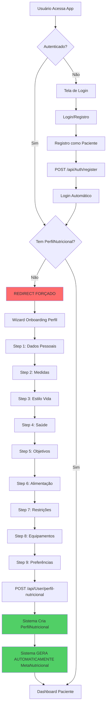

---

## 2. Fluxo de Primeiro Acesso - Nutricionista

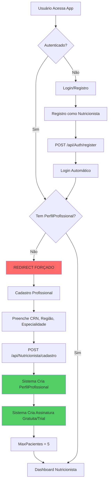

---

## 3. Hierarquia de Dados - Paciente

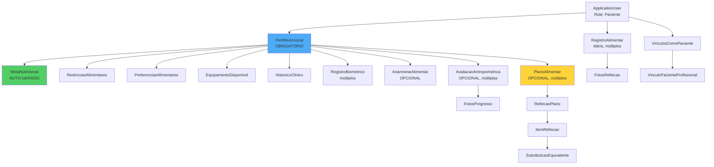

---

## 4. Hierarquia de Dados - Nutricionista

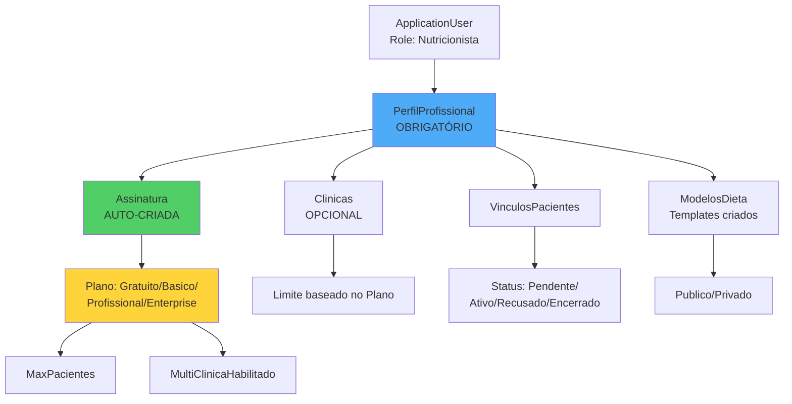

---

## 5. Fluxo de Criação de Perfil Nutricional

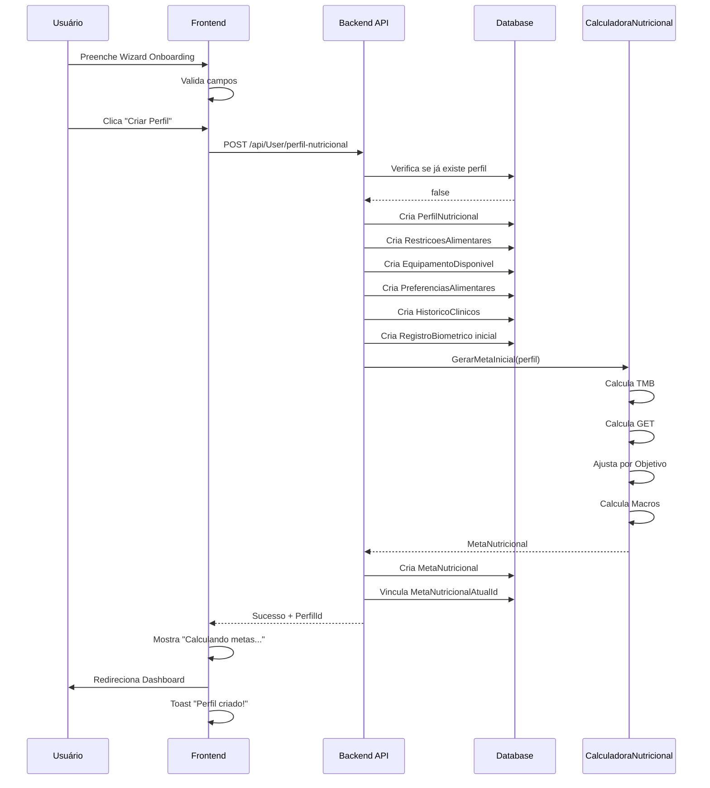

---

## 6. Fluxo de Atualização de Perfil → Recálculo de Meta

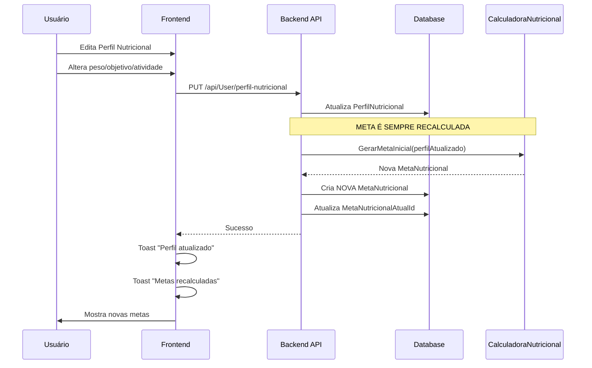

---

## 7. Fluxo de Vínculo Nutricionista-Paciente

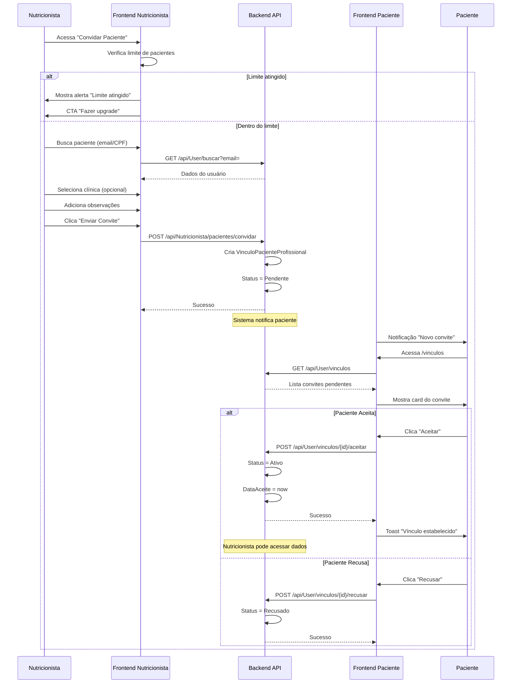

---

## 8. Fluxo de Criação de Plano Alimentar

```mermaid
graph TD
    A[Usuário: Novo Plano] --> B{Escolhe Origem}
    
    B -->|Do Zero| C[Editor Vazio]
    B -->|Template| D[Buscar Templates]
    
    D --> E[Filtrar por Objetivo/Dieta]
    E --> F[Selecionar Template]
    F --> G[Carregar Template no Editor]
    G --> H[Editor com Template]
    
    C --> I[Preenche Info Geral]
    H --> I
    
    I --> J[Nome, Descrição, Datas]
    J --> K[Define Metas Diárias]
    K --> L{Usar Metas do Perfil?}
    
    L -->|Sim| M[Carrega metas automáticas]
    L -->|Não| N[Define manualmente]
    
    M --> O[Adicionar Refeições]
    N --> O
    
    O --> P[Para cada Refeição]
    P --> Q[Define Tipo, Horário, Ordem]
    Q --> R[Adicionar Itens]
    
    R --> S[Buscar Alimento]
    S --> T[Selecionar Alimento]
    T --> U[Definir Quantidade]
    U --> V[Sistema Calcula Macros]
    V --> W{Adicionar Substituição?}
    
    W -->|Sim| X[Buscar Alimento Substituto]
    X --> Y[Definir Quantidade]
    Y --> Z[Sistema Calcula Macros]
    Z --> AA[Adiciona à lista]
    
    W -->|Não| AB[Item Adicionado]
    AA --> AB
    
    AB --> AC{Mais Itens?}
    AC -->|Sim| R
    AC -->|Não| AD[Sistema Calcula Totais Refeição]
    
    AD --> AE{Mais Refeições?}
    AE -->|Sim| O
    AE -->|Não| AF[Sistema Calcula Totais Plano]
    
    AF --> AG[Preview: Comparação com Meta]
    AG --> AH{Quer Ajustar?}
    AH -->|Sim| O
    AH -->|Não| AI{Salvar como?}
    
    AI -->|Rascunho| AJ[POST com Status=Rascunho]
    AI -->|Publicar| AK{Tem outro Ativo?}
    
    AK -->|Sim| AL[Desativa Ativo Anterior]
    AL --> AM[POST com Status=Ativo]
    AK -->|Não| AM
    
    AJ --> AN[Plano Salvo]
    AM --> AO[Plano Ativo]
    
    AN --> AP[Redireciona /planos]
    AO --> AP
    
    style AM fill:#51cf66
    style AO fill:#51cf66
```

---

## 9. Fluxo de Registro de Consumo

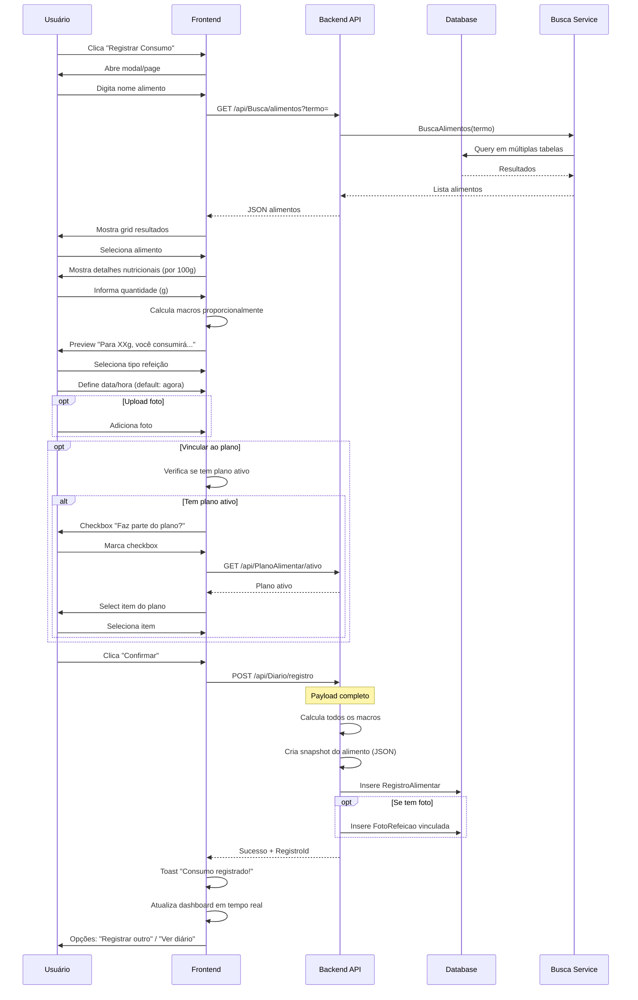

---

## 10. Fluxo de Diário do Dia

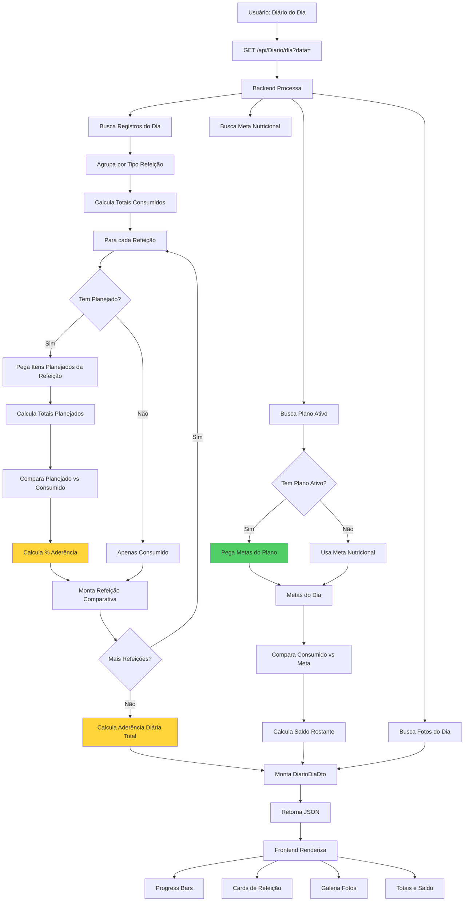

---

## 11. Fluxo de Avaliação Antropométrica

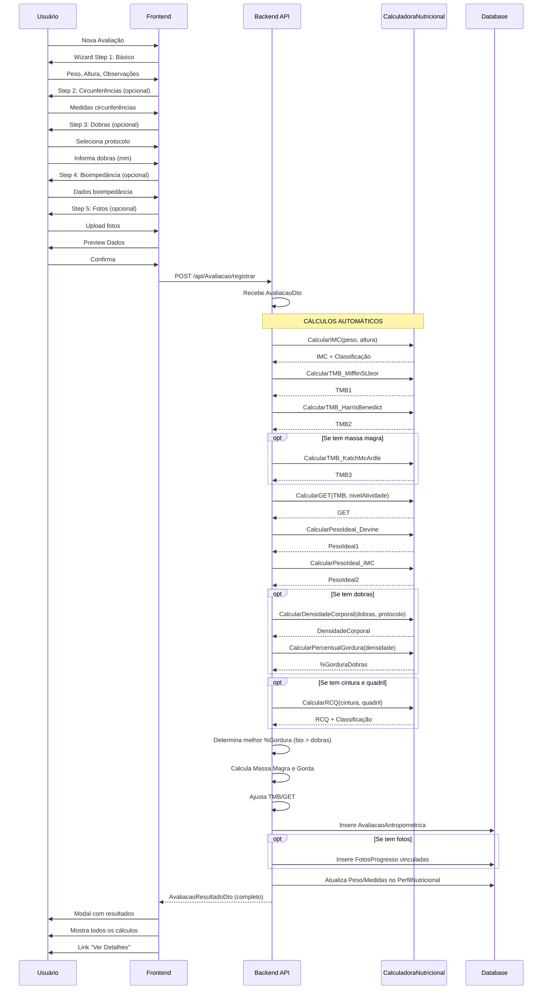

---

## 12. Fluxo de Comparação de Avaliações

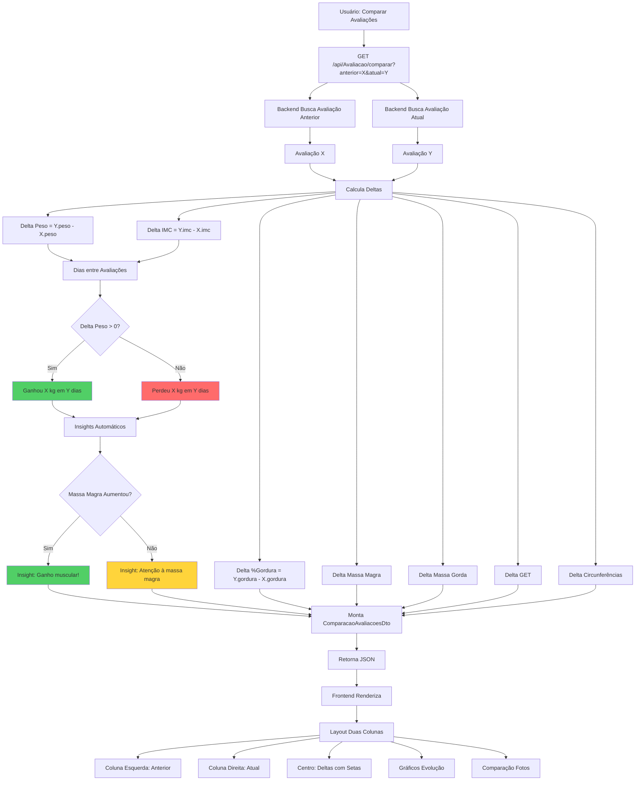

---

## 13. Estados de Plano Alimentar

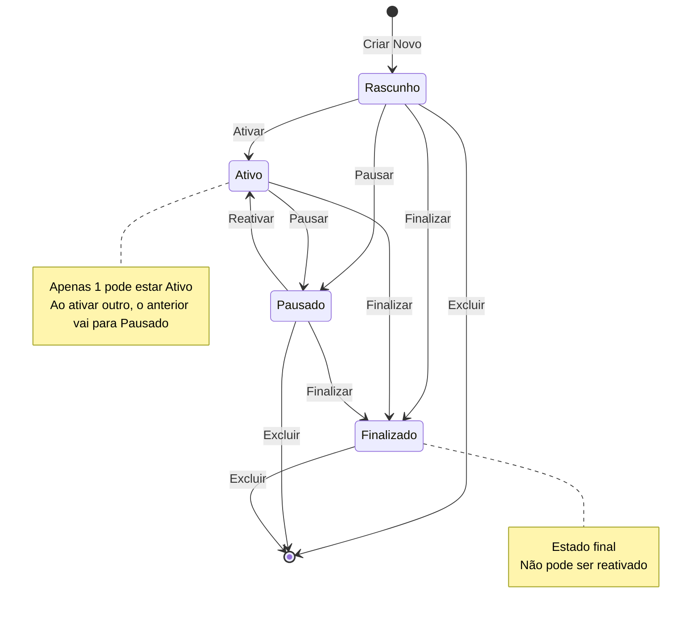

---

## 14. Estados de Vínculo Paciente-Nutricionista

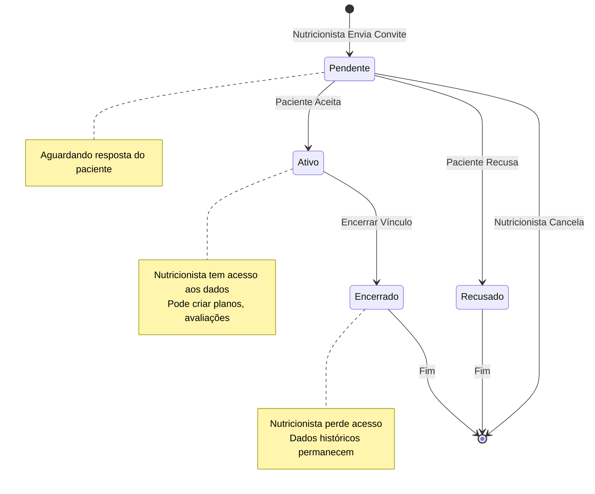

---

## 15. Fluxo Completo de Uso - Caso de Sucesso

```mermaid
graph TD
    A[Usuário se Registra] --> B[Cria Perfil Nutricional]
    B --> C[Sistema Gera Meta Nutricional]
    
    C --> D{Primeira Semana}
    D --> E[Registra Consumo Diariamente]
    E --> F[Compara com Meta]
    F --> G[Vê Relatórios]
    
    G --> H{Segunda Semana}
    H --> I[Registra Peso]
    I --> J[Vê Evolução]
    J --> K[Faz Primeira Avaliação]
    
    K --> L{Terceira Semana}
    L --> M[Cria Plano Alimentar]
    M --> N[Ativa Plano]
    N --> O[Registra Seguindo Plano]
    O --> P[Acompanha Aderência]
    
    P --> Q{Quarta Semana}
    Q --> R[Busca Nutricionista]
    R --> S[Aceita Convite]
    S --> T[Nutricionista Acessa Perfil]
    
    T --> U{Um Mês Depois}
    U --> V[Nutricionista Registra Avaliação]
    V --> W[Compara com Primeira]
    W --> X[Vê Progresso Real]
    
    X --> Y{Continuação}
    Y --> Z[Nutricionista Cria Plano Personalizado]
    Z --> AA[Paciente Segue Novo Plano]
    AA --> AB[Registra Fotos Progresso]
    AB --> AC[Acompanhamento Contínuo]
    
    AC --> AD{3 Meses Depois}
    AD --> AE[Nova Avaliação]
    AE --> AF[Comparação Múltiplas Avaliações]
    AF --> AG[Ajuste de Metas]
    AG --> AH[Atualiza Perfil]
    AH --> AI[Recalcula Metas]
    AI --> AJ[Continua Ciclo]
    
    style C fill:#51cf66
    style N fill:#ffd43b
    style S fill:#51cf66
    style X fill:#40c057
    style AG fill:#4dabf7
```

---

## 16. Arquitetura de Dados Simplificada

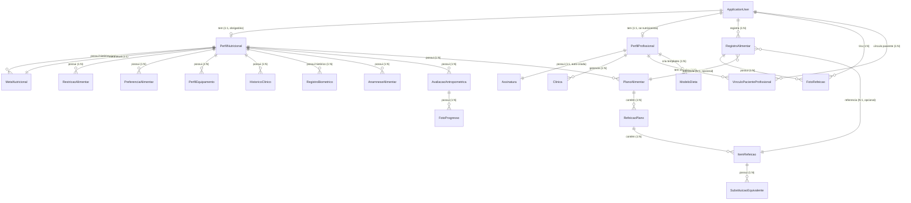

---

## 17. Pipeline de Cálculo de Metas

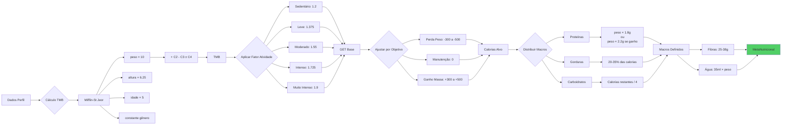

---

## 18. Fluxo de Relatório de Aderência

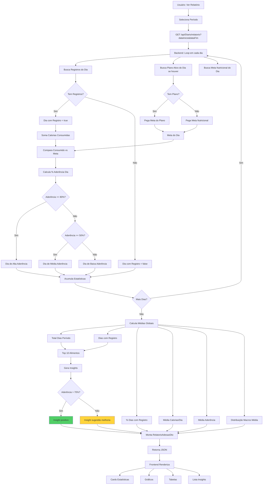

---

**Fim dos Diagramas**

Use estes diagramas em conjunto com os documentos de fluxo e telas para ter uma visão completa da aplicação.
